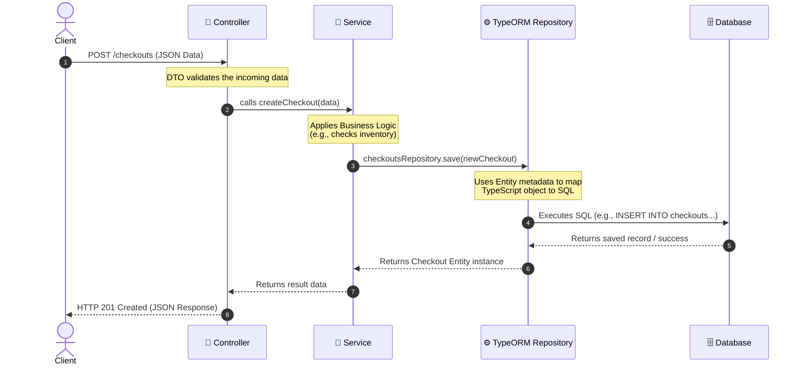

# TypeORM Data Flow Architecture

This document illustrates how a piece of data (like a new Checkout request) flows from the client all the way into your database using NestJS and TypeORM.

## Data Flow Diagram

## Step-by-Step Breakdown

1. **The Request (Client ➡️ Controller):** 
   A client sends an HTTP request (like a POST request to create a checkout) to your application. The **Controller** intercepts this request based on the route (e.g., `/checkouts`). Before doing anything, it usually uses a **DTO** (Data Transfer Object) to validate that the incoming JSON payload is correctly formatted.

2. **Routing to Logic (Controller ➡️ Service):**
   The Controller shouldn't do the heavy lifting. It simply takes the validated data and passes it to the appropriate method in the **Service** (e.g., `this.checkoutsService.create(...)`).

3. **Business Rules (Inside Service):**
   The **Service** executes your business logic. For example, before saving a checkout, it might need to check if the product is in stock by calling another service, or calculate the total price.

4. **Interacting with the Database (Service ➡️ TypeORM Repository):**
   Once the business logic is complete and data needs to be saved, the Service uses the injected **TypeORM Repository** (e.g., `this.checkoutsRepository`). It calls methods like `.save()`, `.find()`, or `.update()` and passes it the TypeScript object representing the data.

5. **The Translation (TypeORM ➡️ Database):**
   This is where the magic happens. TypeORM looks at the **Entity** definition (e.g., `Checkout` class with `@Entity()` decorators) to understand how the TypeScript object maps to the database tables and columns. It automatically translates the `.save()` command into raw SQL (like `INSERT INTO checkouts (id, productId, quantity) VALUES (...)`) and executes it against the database engine (Postgres, MySQL, etc.).

6. **The Response (Database ➡️ Client):**
   The database confirms the save and returns the new record. TypeORM transforms this raw database response back into a TypeScript Entity instance and hands it back to the Service. The Service returns it to the Controller, which finally packages it into an HTTP response (like a `201 Created` status with the JSON data) and sends it back to the Client.
